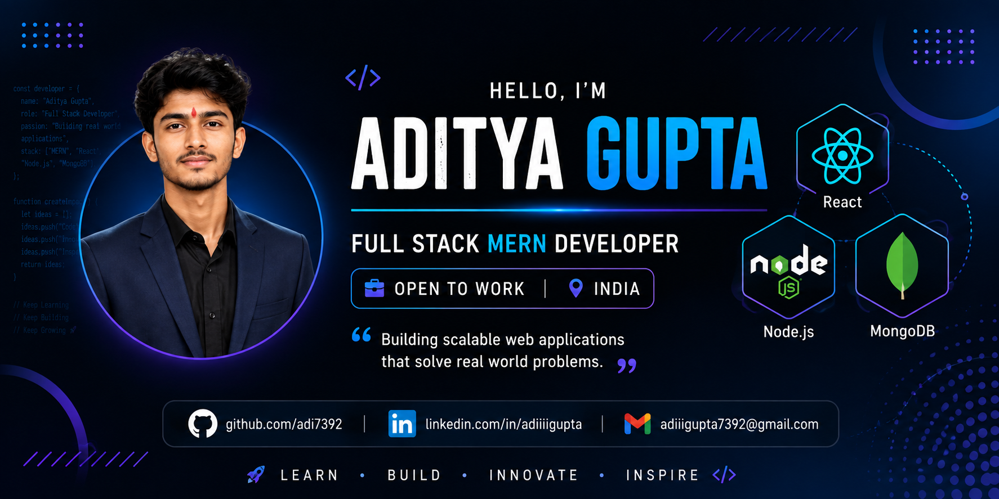

  

<h1 align="center">Hi 👋, I'm Aditya Gupta</h1>

<h3 align="center">
💻 Full Stack MERN Developer | 🚀 Open to Work | 🌱 Lifelong Learner
</h3>

---

# 👨‍💻 About Me

- 🎓 B.Tech CSE Graduate
- 💻 Full Stack MERN Developer
- 🌱 Currently learning **TypeScript & Next.js**
- ⚡ Passionate about Backend Development
- 🚀 Love building real-world web applications
- 💼 Looking for Software Developer opportunities

---

# 🌐 Connect With Me

---

# 💻 Tech Stack

### Languages

### Frontend

### Backend

### Tools

---

# 🚀 Featured Projects

## 🍽️ Cloud Kitchen

✔ MERN Stack Application

✔ JWT Authentication

✔ Cloudinary Image Upload

✔ Admin Dashboard

✔ Role Based Access

---

## 💰 Chitease

✔ Chit Fund Management System

✔ User Authentication

✔ Dashboard

✔ Modern UI

---

## 📈 Flowchart Converter

✔ Mermaid to Flowchart

✔ Responsive UI

✔ Fast & Easy to Use

---
---

# 📊 GitHub Stats

  
  

---

# 🔥 GitHub Streak

  

---

# 🏆 GitHub Trophies

  

---

# 📈 Contribution Graph

  

---

# 📜 Certifications

🏅 GeeksforGeeks MERN Stack Developer

🏅 IBM SkillsBuild Front-End & Web Development

🏅 CSRBOX Internship

---

# 🎯 Current Goals

- 🚀 Master Data Structures & Algorithms
- ⚛️ Learn Next.js & TypeScript
- 💼 Secure a Software Developer Role
- 🌍 Build Scalable Full-Stack Applications

---

# 💡 Quote

> **"First, solve the problem. Then, write the code." – John Johnson**

---

<h3 align="center">
⭐ Thanks for visiting my profile! ⭐
</h3>

  

